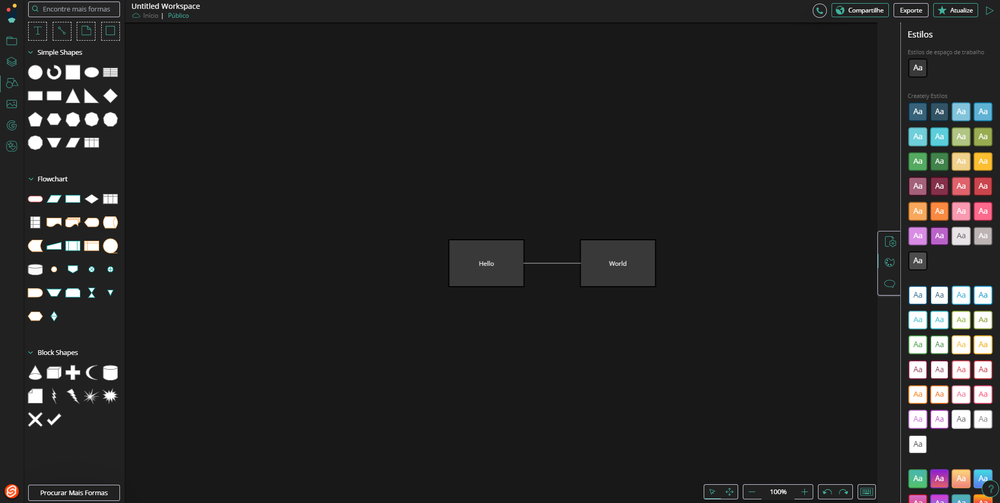

# Creately Dark Theme Extension

## Why is it not published?

I created it for personal use, if you want, clone the repository and build the application using rollup, then register a local extension in developer mode.
